# 👜 Khana

<!--   Replace with the actual path to your banner image -->

Khana is an e-commerce Android app that provides users with a modern shopping experience. Featuring
modern UI and seamless performance, Khana allows users to browse, purchase, and manage products. The
app includes features such as multi-method authentication, personalized advertisements, a smooth
checkout process, order tracking, and much more.

## 📚 Table of Contents

- [Features](#features)
- [Screenshots](#screenshots)
- [Demo](#demo)
- [Installation](#installation)
- [Usage](#usage)
- [Technologies Used](#technologies-used)
- [Architecture](#architecture)
- [Contributing](#contributing)
- [License](#license)

## 🌟 Features

### Core Features

- **Authentication:** Secure sign-up, login, and profile completion, with multiple options:
    - Email and Password
    - OAuth (Google, Facebook)
    - Forgot Password functionality
- **Browsing and Searching:**
    - **Home Screen with Filters:** Filters products by brand, gender, and price range, with sorting
      options (Most Recent, Most Popular, Highest/Lowest Prices).
    - **Product Search:** Search products based on their title.
    - **Product Categories:** Provides organized categories and flash sales for easier navigation.
    - **Product Details:** Detailed product information, including rating, images, available
      sizes/colors, and descriptions.
    - **Wishlist and Cart:** Users can save products to their wishlist and manage items in the
      shopping cart with swipe-to-remove functionality.

### Checkout and Payments

- **Promo Codes:** Allows users to apply discount codes at checkout.
- **Shipping and Address Management:** Users can enter and save shipping addresses and select
  preferred shipping options.
- **Payment Options:** Supports multiple payment methods such as PayPal, Credit Cards, and Cash on
  Delivery (note: currently, the only enabled option is cash on delivery).

### Orders and Tracking

- **Order History:** Shows active, completed, and canceled orders with options to track and reorder.
- **Track Order:** Allows users to monitor shipping status for each order.
- **Review Order:** Lets users leave reviews on completed orders for future reference.

### User Profile and Settings

- **Profile Management:** Users can update profile info and change passwords.
- **Customer Support:** Provides access to a help center with FAQ and contact options.
- **Policies & T&C:** Users can view the privacy policy and the Terms and Conditions of the app.

## 🖼️ Screenshots

| **Sign In**                                                    | **Home 1**                                          | **Home 2**                                         |
|----------------------------------------------------------------|-----------------------------------------------------|----------------------------------------------------|
| 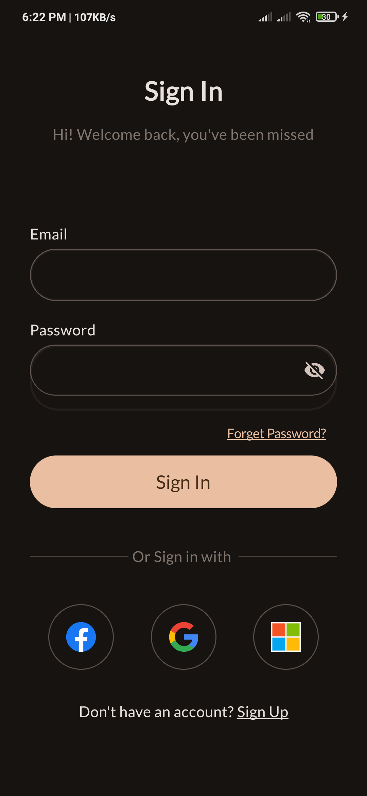           | 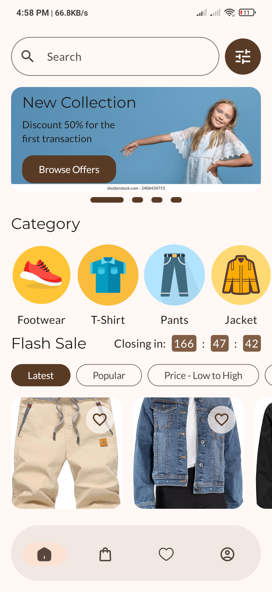 | 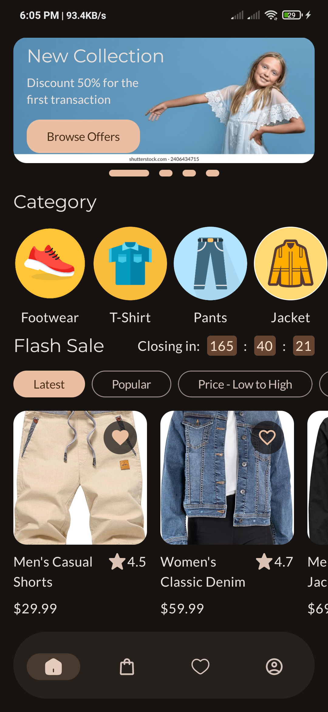 |

| **Search**                                                     | **Search Result**                                         | **Filters**                                           |
|----------------------------------------------------------------|-----------------------------------------------------------|-------------------------------------------------------|
| 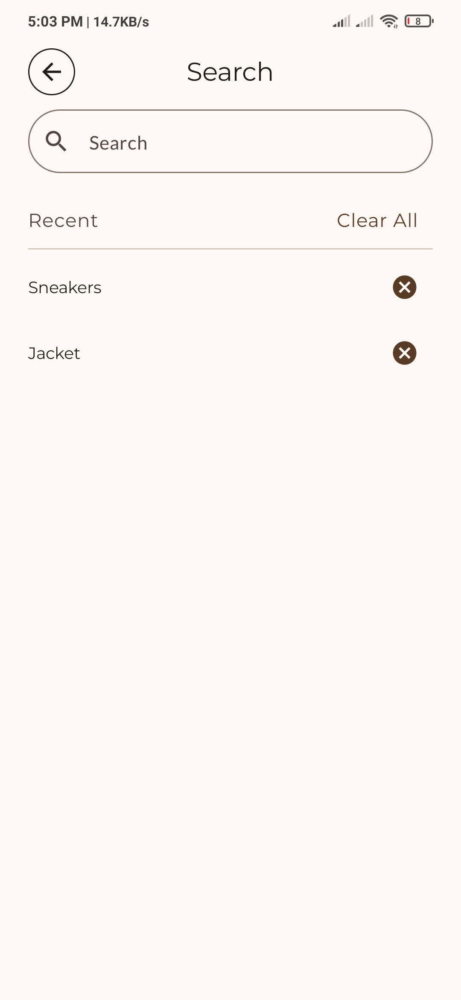           |  | 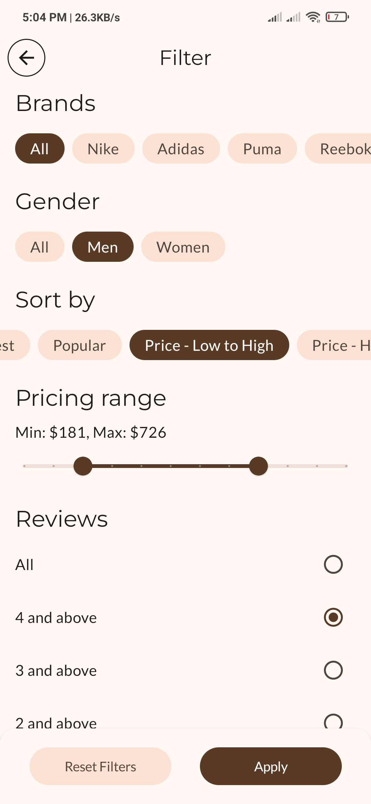 |

| **Coupons**                                                    | **Category**                                             | **Product Details**                                                  |
|----------------------------------------------------------------|----------------------------------------------------------|----------------------------------------------------------------------|
| 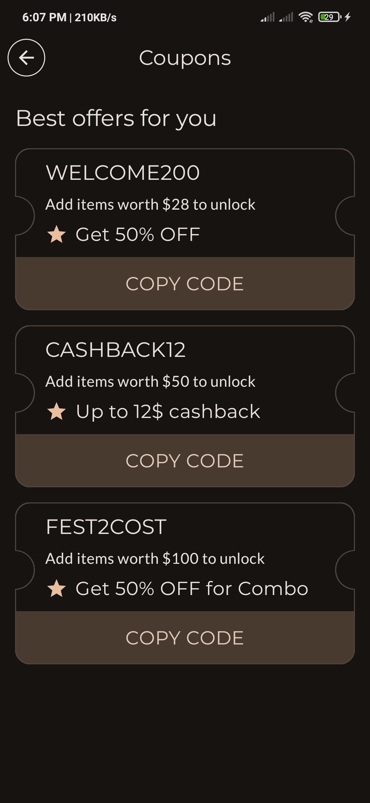          | 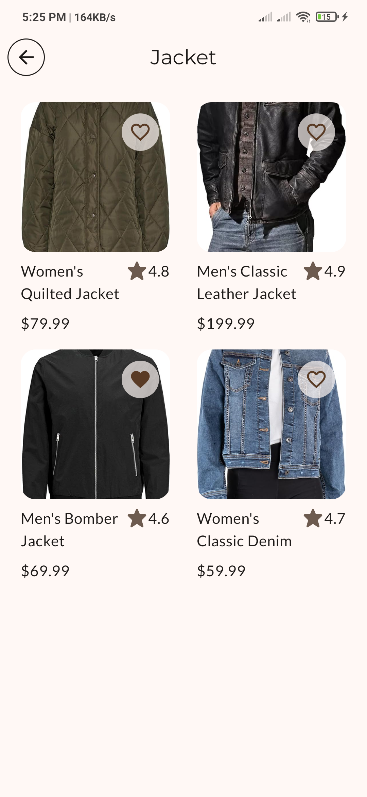 | 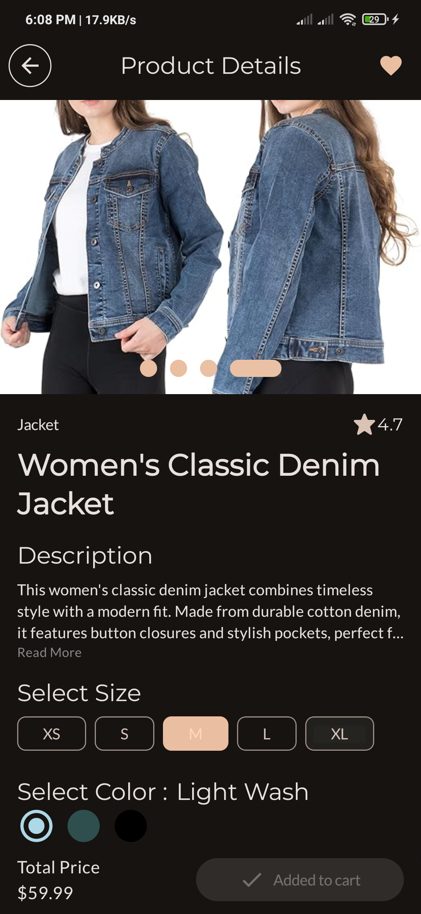 |

| **Cart**                                                       | **Checkout**                                               | **Pick Shipping Address**                                   |
|----------------------------------------------------------------|------------------------------------------------------------|-------------------------------------------------------------|
| 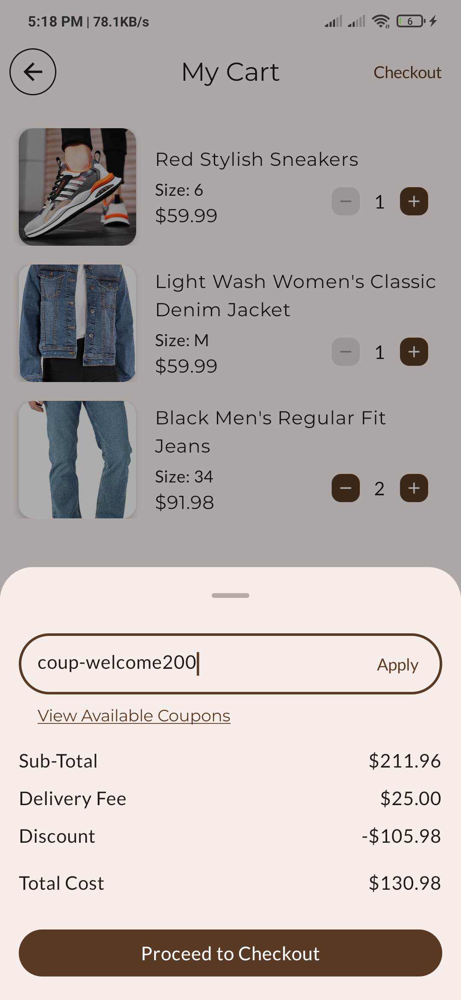               | 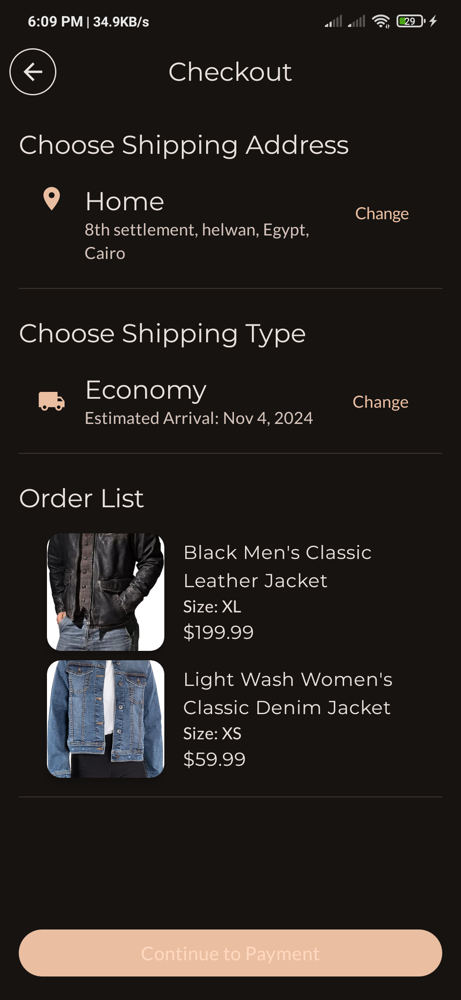 | 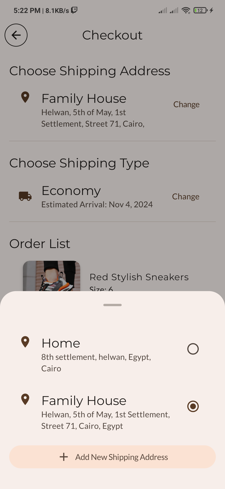 |

| **Pick Shipping Type**                                         | **Payment**                                            | **Wishlist**                                            |
|----------------------------------------------------------------|--------------------------------------------------------|---------------------------------------------------------|
| 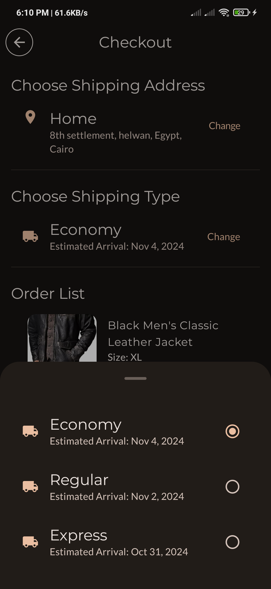     | 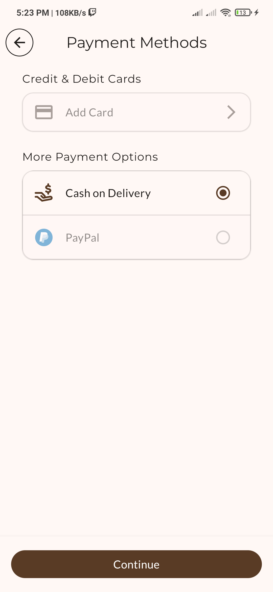 | 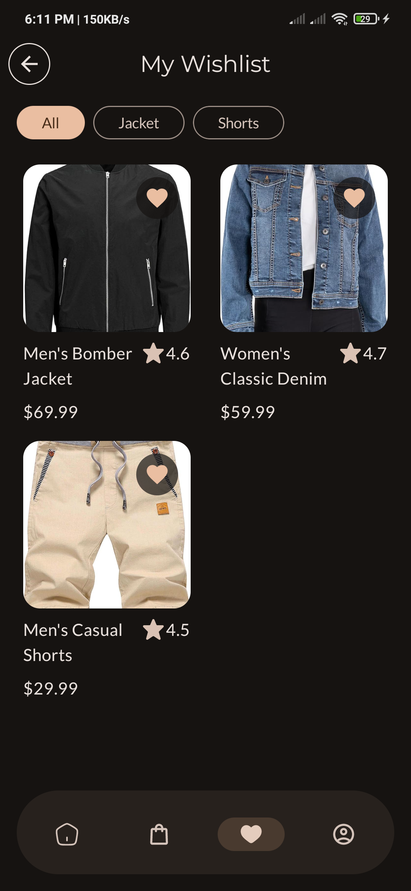 |

| **Profile**                                                    | **My Orders**                                           | **Track Order**                                                |
|----------------------------------------------------------------|---------------------------------------------------------|----------------------------------------------------------------|
| 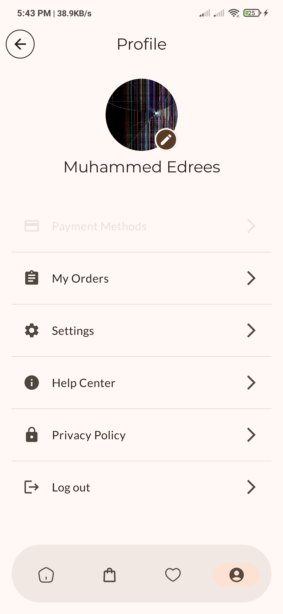         | 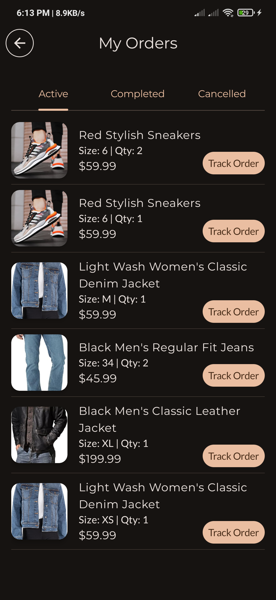 | 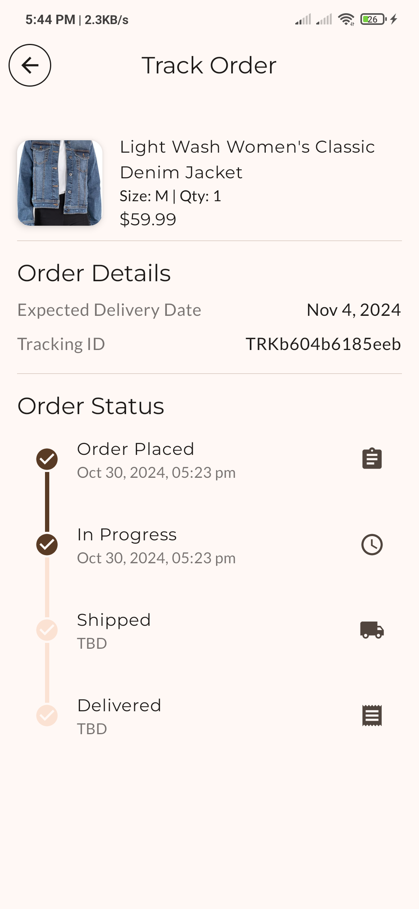 |

| **Leave Review**                                               | **FAQ**                                                  | **Contact Us**                                                |
|----------------------------------------------------------------|----------------------------------------------------------|---------------------------------------------------------------|
| 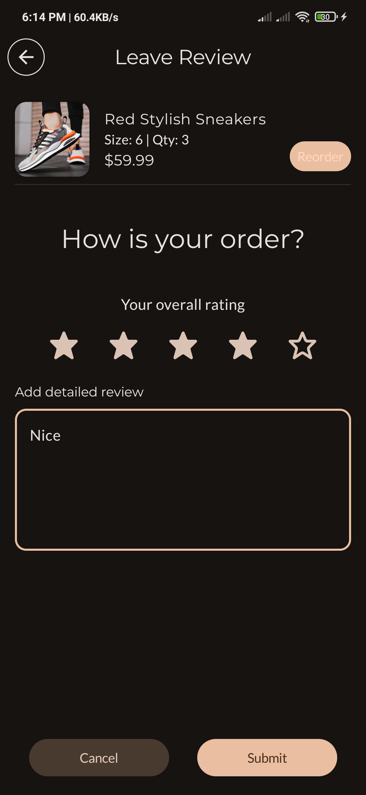 | 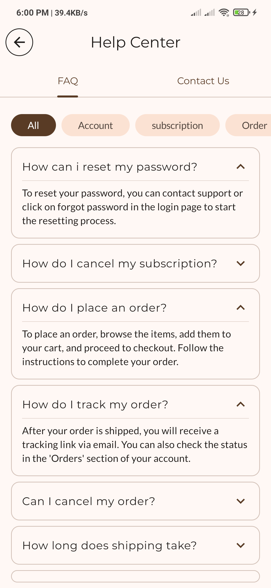 | 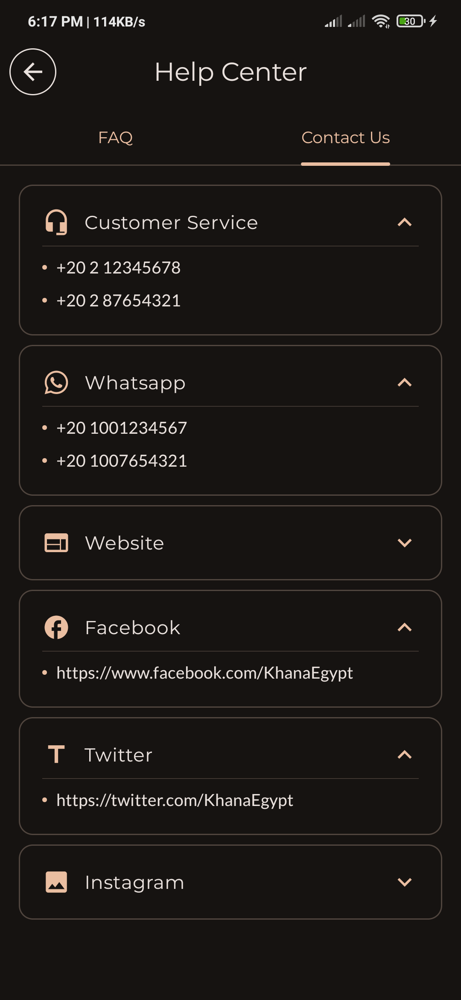 |

| **Privacy Policy**                                                  | **Password Manager**                                                   | 
|---------------------------------------------------------------------|------------------------------------------------------------------------|
| 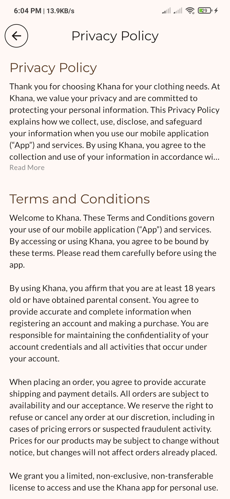 | 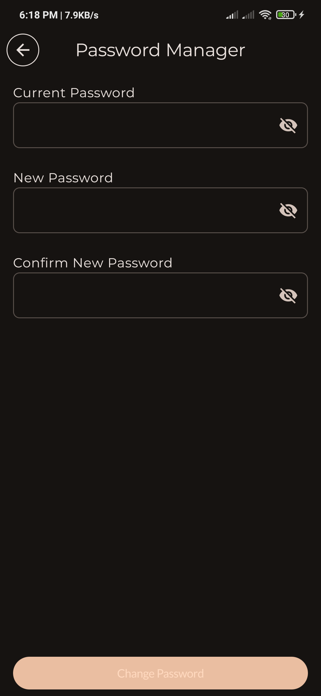 | 

## 🎥 Demo

 

## 📲 Installation

To install Khana, download the latest release APK file from
the [Releases](https://github.com/Zaed-solutions/Khana/releases) section.

1. Download the `app-release.apk` file.
2. Enable installation from unknown sources in your device settings.
3. Open the APK file and follow the installation prompts.
   **Note:** To run the app, you need to run the local server from
   the [KhanaServer](https://github.com/Zaed-solutions/KhanaServer) repository.

## ✨ Usage

1. Open the app and sign up or log in.
2. Browse available products on the home screen, filter, or search for specific items.
3. Add items to the cart or wishlist.
4. Apply promo codes and proceed to checkout.
5. Track orders and manage profile settings.
6. Enjoy shopping 🤎

## 🛠️ Built With

### Core Technologies

- **Kotlin:** Primary language used for Android app development.
- **Android Jetpack:**
    - Compose for building declarative and responsive UIs.
    - Navigation for managing app navigation.
    - Material3 and Material Icons for UI components and icons.
    - Splash Screen API for enhanced app launch animations.
- **Kotlin Coroutines:** Concurrency design pattern that you can use on Android to simplify code
  that executes asynchronously.

### Serialization and Networking

- **Kotlinx Serialization:** JSON serialization for efficient data handling.
- **Ktor:** Ktor client libraries for network requests and JSON content negotiation.

### Firebase

- **Firebase Authentication:** Enables user sign-up, login, and OAuth support (Google, Facebook).
- **Firebase Storage:** For managing and storing content like images and other media.

### Local Database

- **Realm Database:** Database for offline data persistence.

### Dependency Injection

- **Koin:** Used for dependency injection to make the code modular and testable, with support for
  Android and Compose navigation.

### Image Loading and Animations

- **Coil:** Asynchronous image loading for Compose with automatic caching.
- **Lottie Compose:** For rendering Lottie animations to enhance user experience and the visual
  appeal of the app.

## 📐👷🏻‍♀️ Architecture

Khana follows the MVVM (Model-View-ViewModel) architecture to ensure a clear separation of concerns
and to make the codebase more maintainable and testable.

- **Model:** Data classes and repository for handling data from both remote (Firebase/Rest API) and
  local sources.
- **ViewModel:** Exposes data to the UI and manages states.
- **View:** Composable functions that display the UI and react to ViewModel changes.

## ✍️ Contributing

Contributions are welcome! To contribute:

1. Fork the repository.
2. Create a new branch for your feature/bug fix.
3. Commit your changes and push the branch.
4. Open a pull request with a description of your changes.

## 📄 License

This project is licensed under the MIT License - see the LICENSE file for details.
Khana app is free and open-source software licensed under the MIT License. All designs were created
by [jai ho](https://www.figma.com/community/file/1301918827117662529/clothing-store-app-fashion-e-commerce-app-appuikit)
and distributed under Creative Commons license ([CC BY-SA 4.0 International]()).
